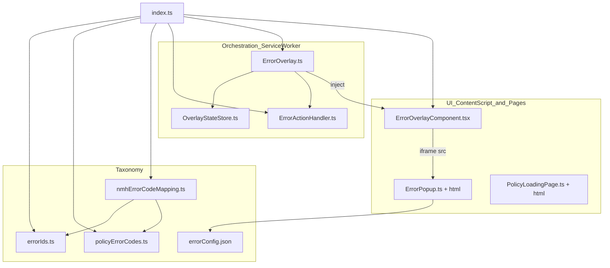
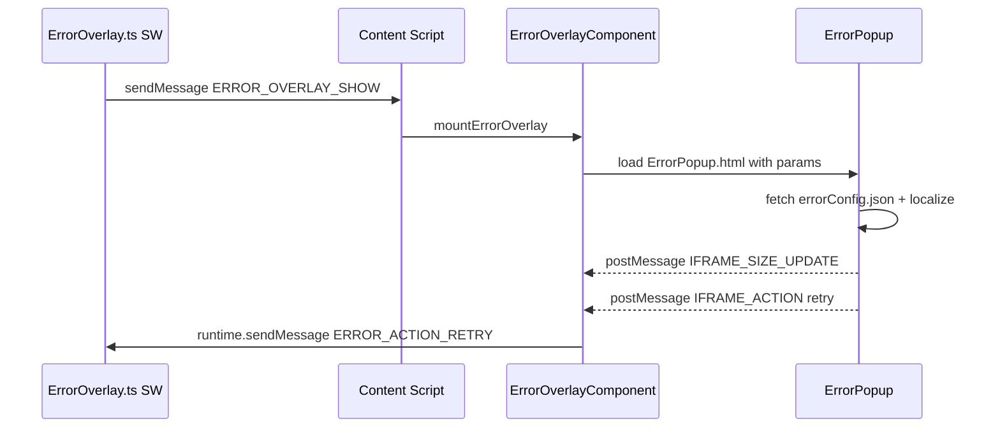

# ErrorHandling - Architecture Documentation

> **Scope**: ErrorHandling component (internal structure).

## Executive Summary
ErrorHandling is split into a pure taxonomy layer (IDs, codes, config, NMH mapping), a service-worker orchestration layer that decides when/where to show error overlays, and a UI layer (injected React host + iframe popup + policy-loading page). The orchestration layer never touches the DOM directly so it stays MV3 service-worker safe, delegating rendering to an injected content script that hosts a sandboxed extension iframe [[ErrorOverlay/ErrorOverlay.ts#L22-L23]](/src/ErrorHandling/ErrorOverlay/ErrorOverlay.ts#L22-L23) [[ErrorOverlay/ErrorOverlayComponent.tsx#L188-L207]](/src/ErrorHandling/ErrorOverlay/ErrorOverlayComponent.tsx#L188-L207).

## Architecture Diagram

## Layers / Modules

### Taxonomy
**Responsibility**: Canonical error IDs, per-throw-site shareable codes, NMH numeric-code mapping, and display metadata.
**Key files**: [errorIds.ts](/src/ErrorHandling/errorIds.ts), [policyErrorCodes.ts](/src/ErrorHandling/policyErrorCodes.ts), [nmhErrorCodeMapping.ts](/src/ErrorHandling/nmhErrorCodeMapping.ts), [errorConfig.json](/src/ErrorHandling/errorConfig.json)
**Pattern**: Const-object enums with derived union types [[errorIds.ts#L8-L22]](/src/ErrorHandling/errorIds.ts#L8-L22).

### Orchestration (service worker)
**Responsibility**: Decide when overlays show, target tabs by domain policy, track/persist per-tab state, and route action messages to callbacks.
**Key files**: [ErrorOverlay/ErrorOverlay.ts](/src/ErrorHandling/ErrorOverlay/ErrorOverlay.ts), [ErrorOverlay/OverlayStateStore.ts](/src/ErrorHandling/ErrorOverlay/OverlayStateStore.ts), [ErrorActionHandler.ts](/src/ErrorHandling/ErrorActionHandler.ts)
**Pattern**: Module-level singleton state + `chrome.tabs`/`chrome.runtime` listeners [[ErrorOverlay/ErrorOverlay.ts#L49-L57]](/src/ErrorHandling/ErrorOverlay/ErrorOverlay.ts#L49-L57).

### UI (content script + pages)
**Responsibility**: Host the overlay iframe on the page, render the popup from config + localization, and drive the policy-loading page state machine.
**Key files**: [ErrorOverlay/ErrorOverlayComponent.tsx](/src/ErrorHandling/ErrorOverlay/ErrorOverlayComponent.tsx), [ErrorOverlay/ErrorPopup.ts](/src/ErrorHandling/ErrorOverlay/ErrorPopup.ts), [PolicyLoadingPage/PolicyLoadingPage.ts](/src/ErrorHandling/PolicyLoadingPage/PolicyLoadingPage.ts)
**Pattern**: React root injected into page DOM; iframe-isolated popup with `postMessage` bridge [[ErrorOverlay/ErrorOverlayComponent.tsx#L251-L267]](/src/ErrorHandling/ErrorOverlay/ErrorOverlayComponent.tsx#L251-L267).

## Design Patterns
- **Registry / config-driven UI**: `errorConfig.json` is fetched and looked up by ID to populate the popup [[ErrorOverlay/ErrorPopup.ts#L97-L105]](/src/ErrorHandling/ErrorOverlay/ErrorPopup.ts#L97-L105).
- **Callback registry**: `ErrorActionHandler` stores retry/cancel/sign-in callbacks keyed by action type [[ErrorActionHandler.ts#L31-L48]](/src/ErrorHandling/ErrorActionHandler.ts#L31-L48).
- **Write-through cache**: `OverlayStateStore` mirrors an in-memory Map to session storage for SW-restart durability [[ErrorOverlay/OverlayStateStore.ts#L16-L86]](/src/ErrorHandling/ErrorOverlay/OverlayStateStore.ts#L16-L86).
- **Guarded postMessage bridge**: origin, source-window, and extension-ID validation on every inbound message [[ErrorOverlay/ErrorOverlayComponent.tsx#L346-L379]](/src/ErrorHandling/ErrorOverlay/ErrorOverlayComponent.tsx#L346-L379).

## Data Flow

## Integration Points

### External
| Service | Purpose | Protocol |
|---------|---------|----------|
| Chrome Extension APIs | tabs query/message, script injection, runtime messaging, session storage | chrome.* [[ErrorOverlay/ErrorOverlay.ts#L218-L229]](/src/ErrorHandling/ErrorOverlay/ErrorOverlay.ts#L218-L229) |

## Security
- **Overlay message trust**: inbound `postMessage` accepted only from the extension origin, the tracked iframe `contentWindow`, and matching `chrome.runtime.id` [[ErrorOverlay/ErrorOverlayComponent.tsx#L346-L379]](/src/ErrorHandling/ErrorOverlay/ErrorOverlayComponent.tsx#L346-L379).
- **Action gating**: only `RETRY`, `DOWNLOAD_LOGS`, and `SIGN_IN` actions are accepted; others are rejected and logged [[ErrorOverlay/ErrorOverlayComponent.tsx#L383-L390]](/src/ErrorHandling/ErrorOverlay/ErrorOverlayComponent.tsx#L383-L390).
- **URL filtering**: overlays only injected on `http(s)` navigations, excluding extension/chrome pages [[ErrorOverlay/ErrorOverlayComponent.tsx#L10-L17]](/src/ErrorHandling/ErrorOverlay/ErrorOverlayComponent.tsx#L10-L17).

## Known Limitations
- On extension reload, MV3 content scripts may be absent on open tabs; the module injects `ErrorOverlayComponent.js` on-demand before retrying delivery [[ErrorOverlay/ErrorOverlay.ts#L218-L229]](/src/ErrorHandling/ErrorOverlay/ErrorOverlay.ts#L218-L229).
- Popup translations may contain HTML and are injected via `innerHTML` from bundled translation files [[ErrorOverlay/ErrorPopup.ts#L204-L215]](/src/ErrorHandling/ErrorOverlay/ErrorPopup.ts#L204-L215).
