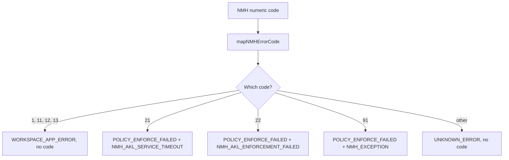

# NMH Error Code Mapping Flow

## Overview
**Flow Type**: Data Flow
**Trigger**: A caller receives a numeric error code from a Native Messaging Host response.
**Outcome**: The numeric code is translated into a user-facing `errorId` and an optional shareable `errorCode`.

## Flow Diagram

## Steps
### Step 1: Call the mapper
`mapNMHErrorCode()` takes an `NMHErrorCode` and returns `{ errorId, errorCode }` [[nmhErrorCodeMapping.ts#L37-L84]](/src/ErrorHandling/nmhErrorCodeMapping.ts#L37-L84).

### Step 2: Resolve category
SDK/CWA install/version codes (1/11/12/13) map to `WORKSPACE_APP_ERROR`; AKL/exception codes (21/22/91) map to `POLICY_ENFORCE_FAILED` with a `CSA_ERROR_0001xx` sub-code [[nmhErrorCodeMapping.ts#L39-L79]](/src/ErrorHandling/nmhErrorCodeMapping.ts#L39-L79) [[policyErrorCodes.ts#L70-L92]](/src/ErrorHandling/policyErrorCodes.ts#L70-L92).

### Step 3: Fallback
Any unrecognized code returns `UNKNOWN_ERROR` with no sub-code [[nmhErrorCodeMapping.ts#L81-L83]](/src/ErrorHandling/nmhErrorCodeMapping.ts#L81-L83).

## Components Involved
| Component | File Path | Role in Flow |
|-----------|-----------|--------------|
| NMH mapper | [nmhErrorCodeMapping.ts](/src/ErrorHandling/nmhErrorCodeMapping.ts) | Translate numeric → taxonomy |
| Error IDs | [errorIds.ts](/src/ErrorHandling/errorIds.ts) | Target categories |
| Enforce codes | [policyErrorCodes.ts](/src/ErrorHandling/policyErrorCodes.ts) | Shareable sub-codes |

## Related Flows
- [overlay-display.md](overlay-display.md)
