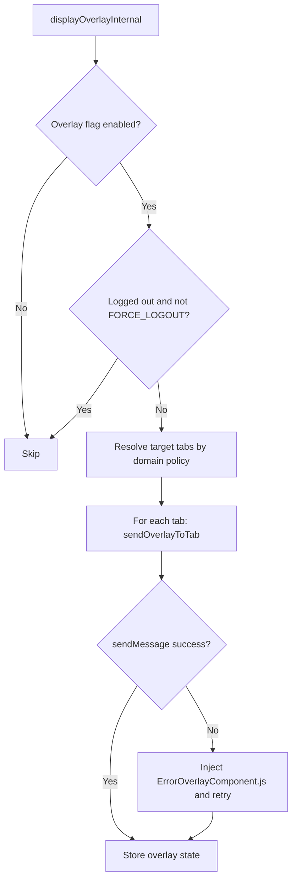

# RTU Error Overlay Display Flow

## Overview
**Flow Type**: Integration Flow
**Trigger**: A component calls `displayErrorOverlay` / `displayAccessBlockedErrorOverlay` / `displayForceLogoutOverlay` from the service worker.
**Outcome**: An error popup iframe is rendered over matching browser tabs.

## Flow Diagram

## Steps
### Step 1: Gate on feature flag
`ErrorOverlay.ts` → `displayOverlayInternal()` checks the access-blocked vs policy-error flag and returns early if disabled [[ErrorOverlay/ErrorOverlay.ts#L460-L471]](/src/ErrorHandling/ErrorOverlay/ErrorOverlay.ts#L460-L471).

### Step 2: Gate on session
Skips display when the user is logged out, except for `FORCE_LOGOUT` [[ErrorOverlay/ErrorOverlay.ts#L473-L480]](/src/ErrorHandling/ErrorOverlay/ErrorOverlay.ts#L473-L480).

### Step 3: Register callbacks + tab tracking
Optionally enables new-tab tracking and registers retry/cancel/sign-in callbacks on `ErrorActionHandler` [[ErrorOverlay/ErrorOverlay.ts#L486-L511]](/src/ErrorHandling/ErrorOverlay/ErrorOverlay.ts#L486-L511).

### Step 4: Resolve target tabs
Filters tabs to valid `http(s)` URLs, excluded host patterns, and domain-policy matches [[ErrorOverlay/ErrorOverlay.ts#L297-L313]](/src/ErrorHandling/ErrorOverlay/ErrorOverlay.ts#L297-L313).

### Step 5: Deliver to each tab
`sendOverlayToTab()` messages the content script; on failure it injects `ErrorOverlayComponent.js` and retries, then persists state [[ErrorOverlay/ErrorOverlay.ts#L328-L364]](/src/ErrorHandling/ErrorOverlay/ErrorOverlay.ts#L328-L364).

### Step 6: Mount the popup
`ErrorOverlayComponent` mounts a React root and loads `ErrorPopup.html` in a sandboxed iframe with error params [[ErrorOverlay/ErrorOverlayComponent.tsx#L188-L207]](/src/ErrorHandling/ErrorOverlay/ErrorOverlayComponent.tsx#L188-L207) [[ErrorOverlay/ErrorOverlayComponent.tsx#L321-L344]](/src/ErrorHandling/ErrorOverlay/ErrorOverlayComponent.tsx#L321-L344).

## Components Involved
| Component | File Path | Role in Flow |
|-----------|-----------|--------------|
| Overlay orchestrator | [ErrorOverlay/ErrorOverlay.ts](/src/ErrorHandling/ErrorOverlay/ErrorOverlay.ts) | Decide + deliver |
| Overlay host | [ErrorOverlay/ErrorOverlayComponent.tsx](/src/ErrorHandling/ErrorOverlay/ErrorOverlayComponent.tsx) | Mount iframe |
| Popup controller | [ErrorOverlay/ErrorPopup.ts](/src/ErrorHandling/ErrorOverlay/ErrorPopup.ts) | Render content |
| State store | [ErrorOverlay/OverlayStateStore.ts](/src/ErrorHandling/ErrorOverlay/OverlayStateStore.ts) | Persist per-tab state |

## Related Flows
- [overlay-user-action.md](overlay-user-action.md)
