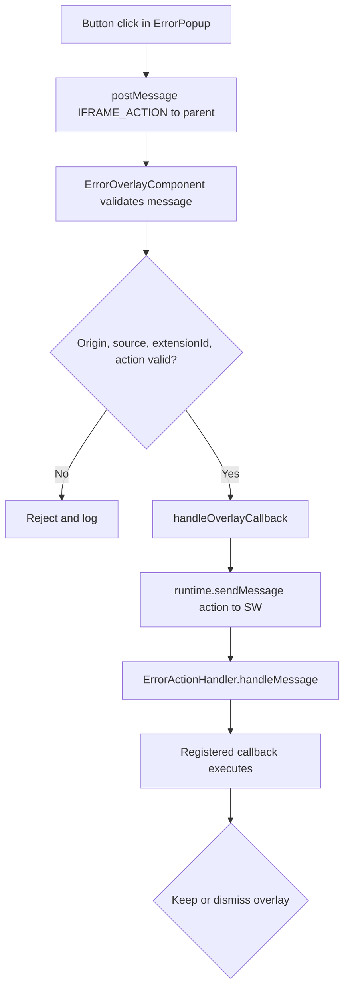

# Overlay User Action Flow

## Overview
**Flow Type**: User Flow
**Trigger**: User clicks Retry, Download Logs, or Sign In inside the error popup iframe.
**Outcome**: The action is validated, forwarded to the service worker, and the registered callback runs.

## Flow Diagram

## Steps
### Step 1: Emit action from iframe
`ErrorPopup.ts` posts an `IFRAME_ACTION` message (with `extensionId`) to the parent on button click [[ErrorOverlay/ErrorPopup.ts#L446-L485]](/src/ErrorHandling/ErrorOverlay/ErrorPopup.ts#L446-L485).

### Step 2: Validate in overlay host
`ErrorOverlayComponent` accepts the message only if origin, source window, `extensionId`, and action are all trusted [[ErrorOverlay/ErrorOverlayComponent.tsx#L346-L390]](/src/ErrorHandling/ErrorOverlay/ErrorOverlayComponent.tsx#L346-L390).

### Step 3: Forward to service worker
`handleOverlayCallback()` relays the action via `chrome.runtime.sendMessage` and updates tracked state [[ErrorOverlay/ErrorOverlay.ts#L690-L777]](/src/ErrorHandling/ErrorOverlay/ErrorOverlay.ts#L690-L777).

### Step 4: Route to callback
`ErrorActionHandler.handleMessage()` finds the callback for the action and runs it, replying success/error [[ErrorActionHandler.ts#L50-L85]](/src/ErrorHandling/ErrorActionHandler.ts#L50-L85).

### Step 5: Keep or dismiss
Overlay is dismissed for retry and non-`FORCE_LOGOUT` sign-in; kept open for download-logs and for `FORCE_LOGOUT` sign-in until cleared after re-auth [[ErrorOverlay/ErrorOverlayComponent.tsx#L398-L413]](/src/ErrorHandling/ErrorOverlay/ErrorOverlayComponent.tsx#L398-L413).

## Decision Points
| Decision | Condition | Path A | Path B |
|----------|-----------|--------|--------|
| Message trust | origin/source/extensionId/action valid | Proceed | Reject + log |
| Post-action | action is download-logs or FORCE_LOGOUT sign-in | Keep overlay | Dismiss overlay |

## Related Flows
- [overlay-display.md](overlay-display.md)
