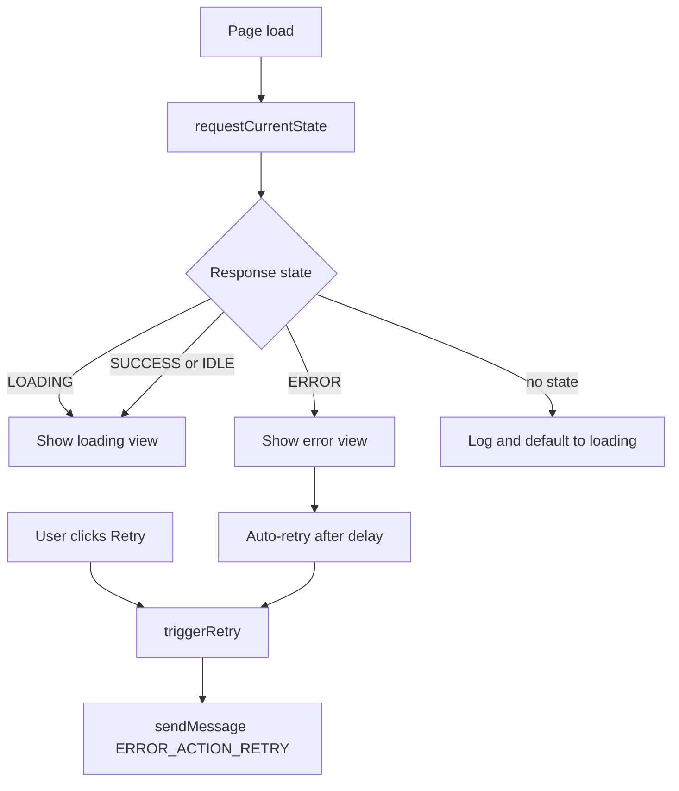

# Policy Loading Page Flow

## Overview
**Flow Type**: UI Navigation / State Flow
**Trigger**: The policy-loading page loads (SSH/RDP gated on policy fetch) and receives policy-fetch state.
**Outcome**: Shows a loading view or an error view, with F5 auto-retry and a manual retry button.

## Flow Diagram

## Steps
### Step 1: Request current state
On DOM ready, `requestCurrentState()` sends `POLICY_STATE_REQUEST` to the background [[PolicyLoadingPage/PolicyLoadingPage.ts#L61-L75]](/src/ErrorHandling/PolicyLoadingPage/PolicyLoadingPage.ts#L61-L75).

### Step 2: Render initial state
`handleInitialState()` shows loading or error; on `ERROR` it schedules an auto-retry (F5 behavior) [[PolicyLoadingPage/PolicyLoadingPage.ts#L81-L100]](/src/ErrorHandling/PolicyLoadingPage/PolicyLoadingPage.ts#L81-L100).

### Step 3: React to state changes
A `POLICY_STATE_CHANGE` listener calls `updateState()` to toggle views [[PolicyLoadingPage/PolicyLoadingPage.ts#L22-L56]](/src/ErrorHandling/PolicyLoadingPage/PolicyLoadingPage.ts#L22-L56).

### Step 4: Retry
`triggerRetry()` (auto or button) sends `ERROR_ACTION_RETRY` to the background, which routes to the registered policy-init callback [[PolicyLoadingPage/PolicyLoadingPage.ts#L105-L144]](/src/ErrorHandling/PolicyLoadingPage/PolicyLoadingPage.ts#L105-L144).

## Components Involved
| Component | File Path | Role in Flow |
|-----------|-----------|--------------|
| Page controller | [PolicyLoadingPage/PolicyLoadingPage.ts](/src/ErrorHandling/PolicyLoadingPage/PolicyLoadingPage.ts) | State machine + retry |
| Page markup | [PolicyLoadingPage/PolicyLoading.html](/src/ErrorHandling/PolicyLoadingPage/PolicyLoading.html) | Loading + error views |

## Decision Points
| Decision | Condition | Path A | Path B |
|----------|-----------|--------|--------|
| Initial render | state is ERROR | Show error + auto-retry | Show loading |
