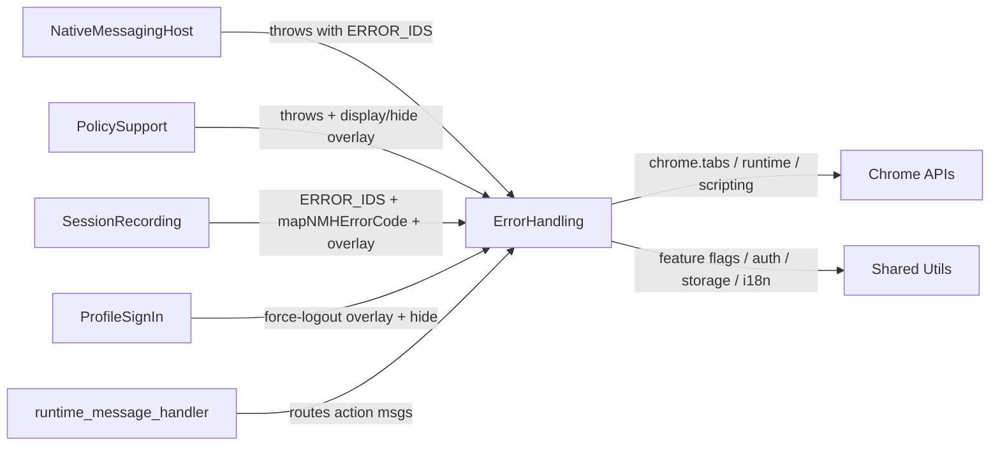

# ErrorHandling - Interactions

> **Scope**: Cross-component connections revealed by ErrorHandling's source and by importers of its barrel [[index.ts#L1-L36]](/src/ErrorHandling/index.ts#L1-L36).

## Interaction Overview

## Inbound Interactions (consumers of ErrorHandling)

### PolicySupport
- **Direction**: inbound
- **Type**: imports
- **Path/Reference**: `../ErrorHandling` / `src/ErrorHandling`
- **Purpose**: Throws `ExtensionError` with `ERROR_IDS` + `POLICY_*_ERROR_CODES`, calls `displayErrorOverlay` / `displayAccessBlockedErrorOverlay` / `hideOverlayErrors`, and uses `mapNMHErrorCode` [[PolicySupport/PolicyErrorHandler.ts#L5-L10]](/src/PolicySupport/PolicyErrorHandler.ts#L5-L10) [[PolicySupport/PolicyRelayOrchestrator.ts#L12-L19]](/src/PolicySupport/PolicyRelayOrchestrator.ts#L12-L19) [[PolicySupport/PolicyOrchestrator.ts#L6-L6]](/src/PolicySupport/PolicyOrchestrator.ts#L6-L6).

### NativeMessagingHost
- **Direction**: inbound
- **Type**: imports
- **Path/Reference**: `../ErrorHandling`
- **Purpose**: Throws with `ERROR_IDS` (`EPA_NOT_INSTALLED`, `WORKSPACE_APP_ERROR`, `POLICY_ENFORCE_FAILED`) and `POLICY_*_ERROR_CODES` for connection/handshake/JWS failures [[NativeMessagingHost/PersistentNMHConnector.ts#L4-L4]](/src/NativeMessagingHost/PersistentNMHConnector.ts#L4-L4) [[NativeMessagingHost/EPASecureNMHConnectionManager.ts#L171-L195]](/src/NativeMessagingHost/EPASecureNMHConnectionManager.ts#L171-L195) [[NativeMessagingHost/JWSValidation/errors.ts#L10-L73]](/src/NativeMessagingHost/JWSValidation/errors.ts#L10-L73).

### SessionRecording
- **Direction**: inbound
- **Type**: imports
- **Path/Reference**: `../ErrorHandling`
- **Purpose**: Uses `ERROR_IDS` (incl. a pass-through allowlist) plus `displayErrorOverlay` / `hideOverlayErrors` in `SROrchestrator`, and `mapNMHErrorCode` in `SRPayloadManager` for recording errors [[SessionRecording/SROrchestrator.ts#L13-L47]](/src/SessionRecording/SROrchestrator.ts#L13-L47) [[SessionRecording/SRPayloadManager.ts#L4-L6]](/src/SessionRecording/SRPayloadManager.ts#L4-L6).

### ProfileSignIn
- **Direction**: inbound
- **Type**: imports
- **Path/Reference**: `../ErrorHandling`
- **Purpose**: Calls `displayForceLogoutOverlay` and `hideOverlayErrors` for force-logout / re-auth prompts [[ProfileSignIn/ProfileSignInTracker.ts#L6-L7]](/src/ProfileSignIn/ProfileSignInTracker.ts#L6-L7) [[ProfileSignIn/browserSessionReauthSetup.ts#L38-L38]](/src/ProfileSignIn/browserSessionReauthSetup.ts#L38-L38).

### runtime_message_handler
- **Direction**: inbound
- **Type**: runtime message routing
- **Path/Reference**: `chrome.runtime.onMessage` → `ErrorActionHandler`
- **Purpose**: Background handler routes the policy-loading-page retry (`ERROR_ACTION_RETRY` with no `tabId`/`url`) to `PolicyOrchestrator`, plus `ERROR_ACTION_DOWNLOAD_LOGS` and `POLICY_STATE_REQUEST`; overlay retry/sign-in messages (which carry `tabId`) bypass it and are handled by `ErrorActionHandler`'s own listener registered in `ErrorOverlay.ts` [[runtime_message_handler.ts#L112-L142]](/src/runtime_message_handler.ts#L112-L142) [[ErrorOverlay/ErrorOverlay.ts#L171-L190]](/src/ErrorHandling/ErrorOverlay/ErrorOverlay.ts#L171-L190).

## Outbound Interactions (ErrorHandling depends on)

### Shared modules (constants, Logger, FeatureFlag, Utils, Storage, Localization)
- **Direction**: outbound
- **Type**: imports
- **Purpose**: Event/state enums, logging, overlay gating flags, logged-out/domain/url helpers, session-storage persistence, and popup localization (see [dependencies.md](dependencies.md)) [[ErrorOverlay/ErrorOverlay.ts#L10-L20]](/src/ErrorHandling/ErrorOverlay/ErrorOverlay.ts#L10-L20).

## External Service Interactions

### Chrome Extension APIs
- **Protocol**: `chrome.*` (SDK)
- **Purpose**: `chrome.tabs` query/message + onUpdated/onRemoved, `chrome.scripting.executeScript` for on-demand injection, `chrome.runtime` messaging + `getURL`, and session storage for state [[ErrorOverlay/ErrorOverlay.ts#L129-L159]](/src/ErrorHandling/ErrorOverlay/ErrorOverlay.ts#L129-L159) [[ErrorOverlay/ErrorOverlay.ts#L218-L229]](/src/ErrorHandling/ErrorOverlay/ErrorOverlay.ts#L218-L229).

### Web-accessible resources (manifest)
- **Direction**: inbound (loaded by pages/content scripts)
- **Type**: web_accessible_resources
- **Path/Reference**: `ErrorHandling/*` and `SSHRDPFeatureDisabled.html` for `<all_urls>`
- **Purpose**: Exposes the error popup, policy-loading page, config, and icons so injected overlays and pages can load them [[manifest.json#L115-L122]](/src/manifest.json#L115-L122).

## Interaction Summary

| Target | Direction | Type | Purpose |
|--------|-----------|------|---------|
| PolicySupport | inbound | imports | throw errors + show/hide overlays |
| NativeMessagingHost | inbound | imports | throw with error IDs/codes |
| SessionRecording | inbound | imports | error IDs, NMH mapping, overlays |
| ProfileSignIn | inbound | imports | force-logout overlays |
| runtime_message_handler | inbound | message routing | route action messages to handler |
| Shared Utils/Logger/etc. | outbound | imports | flags, logging, storage, i18n |
| Chrome APIs | outbound | SDK | tabs, scripting, runtime, storage |
