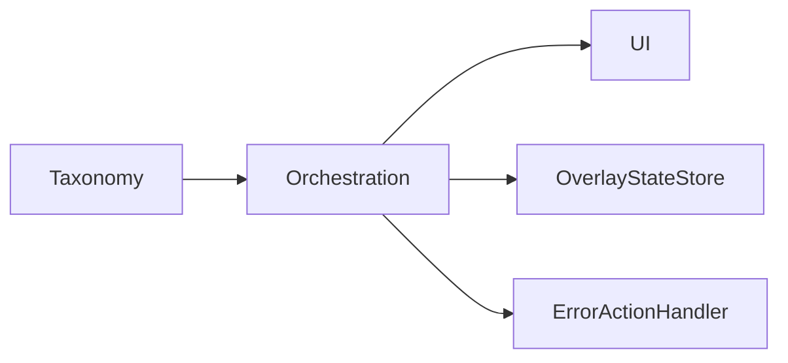

# ErrorHandling - Key Types & Functions

> Grouped by role. Max 20 entries.

## Overview
Taxonomy constants/types feed both the popup UI and callers that throw errors; orchestration functions in `ErrorOverlay.ts` decide display, backed by `OverlayStateStore` and `ErrorActionHandler`.

---

## Taxonomy

### ERROR_IDS / ErrorId
**Source:** [errorIds.ts](/src/ErrorHandling/errorIds.ts)
**Purpose:** Canonical user-facing error categories; `ErrorId` is the derived union type used as `ExtensionError.cause` by throwers [[errorIds.ts#L8-L22]](/src/ErrorHandling/errorIds.ts#L8-L22).

### POLICY_RETRIEVE_ERROR_CODES / POLICY_ENFORCE_ERROR_CODES
**Source:** [policyErrorCodes.ts](/src/ErrorHandling/policyErrorCodes.ts)
**Purpose:** Shareable `CSA_ERROR_*` sub-codes for retrieve (`0000xx`) and enforce (`0001xx`) failures, plus their derived union types [[policyErrorCodes.ts#L37-L92]](/src/ErrorHandling/policyErrorCodes.ts#L37-L92).

### NMH_ERROR_CODES / mapNMHErrorCode
**Source:** [nmhErrorCodeMapping.ts](/src/ErrorHandling/nmhErrorCodeMapping.ts)
**Purpose:** Numeric NMH codes and a mapper to `{ errorId, errorCode }`.

| Name | Parameters | Returns | Description |
|------|------------|---------|-------------|
| `mapNMHErrorCode()` | `nmhCode: NMHErrorCode` | `NMHErrorMapping` | Switch mapping NMH numeric codes to taxonomy; unknown → `UNKNOWN_ERROR` [[nmhErrorCodeMapping.ts#L37-L84]](/src/ErrorHandling/nmhErrorCodeMapping.ts#L37-L84) |

### errorConfig.json
**Source:** [errorConfig.json](/src/ErrorHandling/errorConfig.json)
**Purpose:** Per-ID display metadata (`titleKey`, `messageKey`, `icon`, `actionable`, `retryable`, optional `possibleFixes`/`signInButton`) with `defaultError: UNKNOWN_ERROR` [[errorConfig.json#L1-L106]](/src/ErrorHandling/errorConfig.json#L1-L106).

---

## Orchestration (service worker)

### ErrorActionHandler
**Source:** [ErrorActionHandler.ts](/src/ErrorHandling/ErrorActionHandler.ts)
**Purpose:** Registers per-action callbacks and routes incoming overlay action messages to them, responding async while keeping the message channel open [[ErrorActionHandler.ts#L31-L99]](/src/ErrorHandling/ErrorActionHandler.ts#L31-L99).

| Name | Parameters | Returns | Description |
|------|------------|---------|-------------|
| `setRetryCallback()` / `setCancelCallback()` / `setSignInCallback()` | `callback: ErrorActionCallback` | `void` | Register handlers per action [[ErrorActionHandler.ts#L38-L48]](/src/ErrorHandling/ErrorActionHandler.ts#L38-L48) |
| `handleMessage()` | `message, sender, sendResponse` | `boolean` | Execute matching callback, report success/error [[ErrorActionHandler.ts#L50-L85]](/src/ErrorHandling/ErrorActionHandler.ts#L50-L85) |
| `canHandle()` | `message: unknown` | `message is ErrorActionMessage` | Type-guard; requires a numeric `tabId` to avoid misrouting policy-page retries [[ErrorActionHandler.ts#L87-L98]](/src/ErrorHandling/ErrorActionHandler.ts#L87-L98) |

### displayErrorOverlay
**Source:** [ErrorOverlay/ErrorOverlay.ts](/src/ErrorHandling/ErrorOverlay/ErrorOverlay.ts)
**Purpose:** Show a popup overlay for an error on target tabs (pure injection, no DNR) [[ErrorOverlay/ErrorOverlay.ts#L595-L614]](/src/ErrorHandling/ErrorOverlay/ErrorOverlay.ts#L595-L614).

| Name | Parameters | Returns | Description |
|------|------------|---------|-------------|
| `displayErrorOverlay()` | `errorId, transactionId?, errorCode?, onRetry?, onCancel?, options?` | `Promise<void>` | Delegates to `displayOverlayInternal` [[ErrorOverlay/ErrorOverlay.ts#L595-L614]](/src/ErrorHandling/ErrorOverlay/ErrorOverlay.ts#L595-L614) |

### displayAccessBlockedErrorOverlay
**Source:** [ErrorOverlay/ErrorOverlay.ts](/src/ErrorHandling/ErrorOverlay/ErrorOverlay.ts)
**Purpose:** Show `BLOCK_URL_ERROR` overlay on tabs matching a domain-policy map, tracking new tabs [[ErrorOverlay/ErrorOverlay.ts#L532-L547]](/src/ErrorHandling/ErrorOverlay/ErrorOverlay.ts#L532-L547).

### displayForceLogoutOverlay / displayForceLogoutWarningOverlay
**Source:** [ErrorOverlay/ErrorOverlay.ts](/src/ErrorHandling/ErrorOverlay/ErrorOverlay.ts)
**Purpose:** Show force-logout overlays with a sign-in button; `FORCE_LOGOUT` is the only overlay kept visible while logged out [[ErrorOverlay/ErrorOverlay.ts#L553-L589]](/src/ErrorHandling/ErrorOverlay/ErrorOverlay.ts#L553-L589) [[ErrorOverlay/ErrorOverlay.ts#L473-L480]](/src/ErrorHandling/ErrorOverlay/ErrorOverlay.ts#L473-L480).

### hideOverlayErrors
**Source:** [ErrorOverlay/ErrorOverlay.ts](/src/ErrorHandling/ErrorOverlay/ErrorOverlay.ts)
**Purpose:** Dismiss RTU overlays on one or all tabs, re-hydrating state after SW restart [[ErrorOverlay/ErrorOverlay.ts#L655-L684]](/src/ErrorHandling/ErrorOverlay/ErrorOverlay.ts#L655-L684).

### handleOverlayCallback
**Source:** [ErrorOverlay/ErrorOverlay.ts](/src/ErrorHandling/ErrorOverlay/ErrorOverlay.ts)
**Purpose:** Process a user overlay action (retry/download-logs/sign-in) by messaging the service worker and updating tracked state [[ErrorOverlay/ErrorOverlay.ts#L690-L777]](/src/ErrorHandling/ErrorOverlay/ErrorOverlay.ts#L690-L777).

### retryOverlayForTab
**Source:** [ErrorOverlay/ErrorOverlay.ts](/src/ErrorHandling/ErrorOverlay/ErrorOverlay.ts)
**Purpose:** Re-deliver a tracked overlay to a specific (e.g. newly opened) tab when criteria still apply [[ErrorOverlay/ErrorOverlay.ts#L619-L648]](/src/ErrorHandling/ErrorOverlay/ErrorOverlay.ts#L619-L648).

### cleanupRTUOverlayForTab
**Source:** [ErrorOverlay/ErrorOverlay.ts](/src/ErrorHandling/ErrorOverlay/ErrorOverlay.ts)
**Purpose:** Remove tracking for a tab (used on tab removal); exported for the service worker [[ErrorOverlay/ErrorOverlay.ts#L444-L447]](/src/ErrorHandling/ErrorOverlay/ErrorOverlay.ts#L444-L447).

### OverlayStateStore
**Source:** [ErrorOverlay/OverlayStateStore.ts](/src/ErrorHandling/ErrorOverlay/OverlayStateStore.ts)
**Purpose:** Map of `tabId → OverlayState` with fire-and-forget session-storage persistence and lazy hydration [[ErrorOverlay/OverlayStateStore.ts#L16-L86]](/src/ErrorHandling/ErrorOverlay/OverlayStateStore.ts#L16-L86).

| Name | Parameters | Returns | Description |
|------|------------|---------|-------------|
| `set()` / `delete()` / `clear()` | `tabId, state?` | `void` | Mutate + persist [[ErrorOverlay/OverlayStateStore.ts#L38-L51]](/src/ErrorHandling/ErrorOverlay/OverlayStateStore.ts#L38-L51) |
| `hydrateIfNeeded()` | — | `Promise<void>` | Load persisted state once on fresh SW start [[ErrorOverlay/OverlayStateStore.ts#L53-L70]](/src/ErrorHandling/ErrorOverlay/OverlayStateStore.ts#L53-L70) |

---

## UI (content script + pages)

### ErrorOverlayComponent (mount/dismiss)
**Source:** [ErrorOverlay/ErrorOverlayComponent.tsx](/src/ErrorHandling/ErrorOverlay/ErrorOverlayComponent.tsx)
**Purpose:** React overlay host that injects a full-page backdrop with a sandboxed iframe pointing at `ErrorPopup.html`, and validates iframe postMessages [[ErrorOverlay/ErrorOverlayComponent.tsx#L96-L207]](/src/ErrorHandling/ErrorOverlay/ErrorOverlayComponent.tsx#L96-L207).

| Name | Parameters | Returns | Description |
|------|------------|---------|-------------|
| `mountErrorOverlay()` | `errorId, tabId, transactionId?, errorCode?` | `void` | Unmount existing, render new overlay root [[ErrorOverlay/ErrorOverlayComponent.tsx#L251-L267]](/src/ErrorHandling/ErrorOverlay/ErrorOverlayComponent.tsx#L251-L267) |
| `dismissOverlay()` | `overlayId?` | `boolean` | Unmount + remove one or all overlays [[ErrorOverlay/ErrorOverlayComponent.tsx#L270-L318]](/src/ErrorHandling/ErrorOverlay/ErrorOverlayComponent.tsx#L270-L318) |

### ErrorPopup (showError)
**Source:** [ErrorOverlay/ErrorPopup.ts](/src/ErrorHandling/ErrorOverlay/ErrorPopup.ts)
**Purpose:** Runs inside the iframe: loads `errorConfig.json`, localizes labels, renders title/message/fixes/transaction ID, wires buttons, and reports size via `postMessage` [[ErrorOverlay/ErrorPopup.ts#L370-L513]](/src/ErrorHandling/ErrorOverlay/ErrorPopup.ts#L370-L513).

| Name | Parameters | Returns | Description |
|------|------------|---------|-------------|
| `loadErrorConfig()` | — | `Promise<ErrorConfig>` | Fetch config with fallback to `UNKNOWN_ERROR` [[ErrorOverlay/ErrorPopup.ts#L74-L95]](/src/ErrorHandling/ErrorOverlay/ErrorPopup.ts#L74-L95) |
| `showError()` | `errorId, transactionId?, errorCode?` | `void` | Populate popup + button visibility [[ErrorOverlay/ErrorPopup.ts#L371-L379]](/src/ErrorHandling/ErrorOverlay/ErrorPopup.ts#L371-L379) |

### PolicyLoadingPage controller
**Source:** [PolicyLoadingPage/PolicyLoadingPage.ts](/src/ErrorHandling/PolicyLoadingPage/PolicyLoadingPage.ts)
**Purpose:** Drives the loading/error views from `PolicyFetchState` messages and implements F5 auto-retry plus a manual retry button [[PolicyLoadingPage/PolicyLoadingPage.ts#L33-L155]](/src/ErrorHandling/PolicyLoadingPage/PolicyLoadingPage.ts#L33-L155).

| Name | Parameters | Returns | Description |
|------|------------|---------|-------------|
| `updateState()` | `state: PolicyFetchState` | `void` | Toggle loading vs error view [[PolicyLoadingPage/PolicyLoadingPage.ts#L33-L56]](/src/ErrorHandling/PolicyLoadingPage/PolicyLoadingPage.ts#L33-L56) |
| `triggerRetry()` | — | `void` | Send `ERROR_ACTION_RETRY` to background [[PolicyLoadingPage/PolicyLoadingPage.ts#L105-L118]](/src/ErrorHandling/PolicyLoadingPage/PolicyLoadingPage.ts#L105-L118) |
