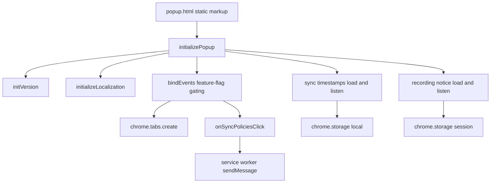
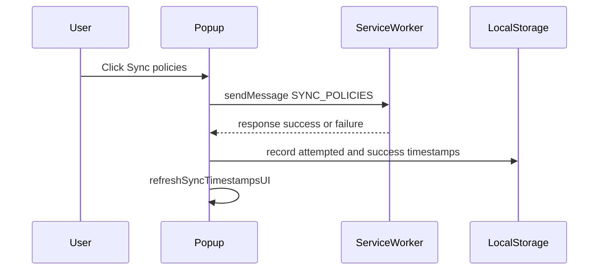

# Popup - Architecture Documentation

> **Scope**: Popup component (single UI page)

## Executive Summary

The popup is a framework-less Manifest V3 action page: `popup.html` provides static markup, and `popup.ts` (an IIFE bundled to `popup.js`) wires it up on load via `initializePopup()`. Logic falls into four concerns — version display, feature-flag-gated event binding, storage-driven UI refresh (sync timestamps, recording notice), and a service-worker message for policy sync [[popup.ts#L221-L248]](/src/Popup/popup.ts#L221-L248).

## Architecture Diagram

## Layers / Modules

### Presentation (markup + styles)
**Responsibility**: Static popup structure, tool buttons, recording notice, and details/sync panel.
**Key files**: `popup.html`, `popup.css` [[popup.html#L9-L62]](/src/Popup/popup.html#L9-L62)

### Controller (popup.ts IIFE)
**Responsibility**: Initialization, feature-flag gating, event binding, storage listeners, and service-worker messaging.
**Key files**: `popup.ts` [[popup.ts#L13-L249]](/src/Popup/popup.ts#L13-L249)
**Pattern**: DOM controller / event-binding script.

## Design Patterns

- **IIFE encapsulation**: single self-invoking function isolates all handlers and helpers from global scope [[popup.ts#L13-L249]](/src/Popup/popup.ts#L13-L249)
- **Feature-flag gating**: UI elements are shown/hidden per flag before handlers are attached [[popup.ts#L119-L173]](/src/Popup/popup.ts#L119-L173)
- **Observer via storage events**: `chrome.storage.onChanged` listeners keep the recording notice and sync timestamps in sync while the popup is open [[popup.ts#L195-L219]](/src/Popup/popup.ts#L195-L219)

## Data Flow

Policy sync is the primary interactive flow: a button click sends a message to the service worker and records timestamps based on the response.

[[popup.ts#L90-L110]](/src/Popup/popup.ts#L90-L110) [[popup.ts#L53-L88]](/src/Popup/popup.ts#L53-L88)

## Known Limitations

- Popup logic runs only while the popup is open; storage listeners are torn down when it closes (inherent to MV3 popups) [[popup.ts#L195-L219]](/src/Popup/popup.ts#L195-L219)
