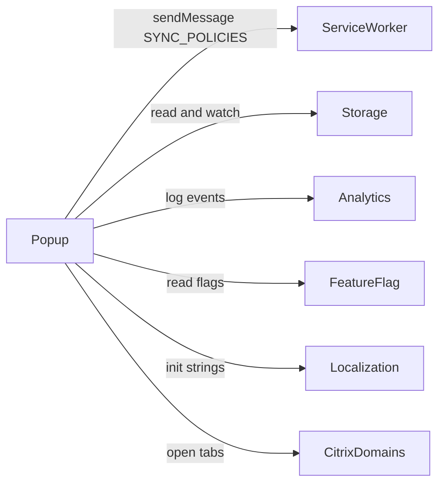

# Popup - Interactions

> **Scope**: Popup component. Detected from imports and `chrome.*` usage in `popup.ts` [[popup.ts#L3-L219]](/src/Popup/popup.ts#L3-L219).

## Interaction Overview

## Interactions

### Service Worker (background)
- **Direction**: outbound (request/response)
- **Type**: message (`chrome.runtime.sendMessage`)
- **Path/Reference**: `{ type: EVENT_TYPES.SYNC_POLICIES }`
- **Purpose**: Request a policy sync and branch on `response.success` to record timestamps [[popup.ts#L90-L110]](/src/Popup/popup.ts#L90-L110)

### Storage
- **Direction**: bidirectional
- **Type**: shared data (`localStorage`, `sessionStorage`, `chrome.storage.onChanged`)
- **Path/Reference**: `SYNC_UI_STORAGE_KEYS`, `SessionRecordingStatusKey`
- **Purpose**: Read/refresh sync timestamps and recording-status notice, and react to changes while open [[popup.ts#L74-L88]](/src/Popup/popup.ts#L74-L88) [[popup.ts#L183-L219]](/src/Popup/popup.ts#L183-L219)

### Analytics
- **Direction**: outbound
- **Type**: imports / function call (`logAnalyticsUserInteractionEvent`)
- **Path/Reference**: `TAP_ACTION_EVENTS.SSH_BUTTON_CLICK`, `RDP_BUTTON_CLICK`, `SYNC_BUTTON_CLICK`
- **Purpose**: Report user tap interactions [[popup.ts#L39-L97]](/src/Popup/popup.ts#L39-L97)

### FeatureFlag
- **Direction**: outbound
- **Type**: imports / function call (`getFeatureFlag`)
- **Path/Reference**: `FeatureFlagKey.SSH`, `RDP`, `SMB`, `SPA_POLICY_SYNC_UI`
- **Purpose**: Gate visibility of tool buttons and the sync UI [[popup.ts#L119-L162]](/src/Popup/popup.ts#L119-L162)

### Localization
- **Direction**: outbound
- **Type**: imports / function call (`initializeLocalization`)
- **Path/Reference**: `data-i18n` attributes in `popup.html`
- **Purpose**: Localize static markup on init [[popup.ts#L226]](/src/Popup/popup.ts#L226) [[popup.html#L21-L60]](/src/Popup/popup.html#L21-L60)

## External Interactions

### Citrix tool domains (new tabs)
- **Protocol**: browser navigation (`chrome.tabs.create`)
- **Purpose**: Launch SSH, Remote Desktop (RDP), and SMB clients at `CITRIXSSH_DOMAIN`, `CITRIXRDP_DOMAIN`, `CITRIXSMB_DOMAIN` [[popup.ts#L37-L49]](/src/Popup/popup.ts#L37-L49)

## Interaction Summary

| Target | Direction | Type | Purpose |
|--------|-----------|------|---------|
| Service worker | outbound | message | Trigger policy sync |
| Storage | bidirectional | shared data | Sync timestamps + recording notice |
| Analytics | outbound | imports | Report tap events |
| FeatureFlag | outbound | imports | Gate UI elements |
| Localization | outbound | imports | Localize markup |
| Citrix domains | outbound | new tab | Launch SSH/RDP/SMB clients |
